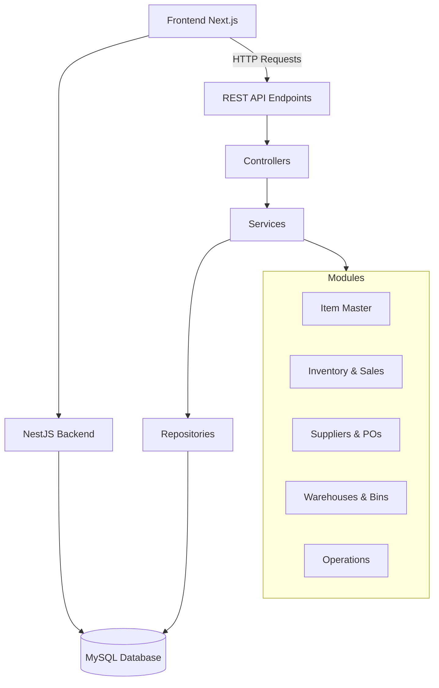

# Inventory Management System


## 📋 Table of Contents

- [📖 Description](#-description)
- [✨ Features](#-features)
- [🏗️ Architecture](#️-architecture)
- [🚀 Getting Started](#-getting-started)
- [📁 Project Structure](#-project-structure)
- [🔧 Configuration](#-configuration)
- [📚 API Documentation](#-api-documentation)
- [🧪 Testing](#-testing)
- [🚀 Deployment](#-deployment)
- [📊 Database Schema](#-database-schema)
- [🔗 API Flow](#-api-flow)
- [🛠️ Development](#️-development)
- [🤝 Contributing](#-contributing)
- [📄 License](#-license)

## 📖 Description

This is a robust **Inventory Management System** built with **NestJS** framework and **TypeScript**. The system provides a comprehensive backend API for managing inventory operations including item management, suppliers, purchase orders, warehouses, transfers, returns, cycle counts, and adjustments.

### Key Business Domains:
- **Item Master Management**: Categories, brands, and product catalog
- **Inventory Operations**: Stock tracking, quantity management, and sales
- **Supply Chain**: Supplier management and purchase order processing
- **Warehouse Management**: Multi-warehouse support with bin organization
- **Inventory Movement**: Transfers, returns, and adjustments
- **Cycle Counting**: Regular inventory verification processes

## ✨ Features

### 🏢 Core Features
- **Item Management**: Create and manage products with types, brands, and detailed specifications
- **Inventory Tracking**: Real-time stock quantity monitoring and management
- **Supplier Management**: Complete supplier lifecycle management
- **Purchase Orders**: Automated purchase order creation and tracking
- **Multi-Warehouse Support**: Manage inventory across multiple warehouse locations
- **Bin Management**: Granular storage location organization
- **Inventory Transfers**: Movement tracking between warehouses and bins
- **Returns Management**: Handle customer returns and supplier returns
- **Cycle Counting**: Scheduled inventory verification and reconciliation
- **Adjustments**: Manual inventory corrections and adjustments

### 🛠️ Technical Features
- **RESTful API**: Clean, well-documented REST endpoints
- **TypeScript**: Full type safety and enhanced developer experience
- **Database Integration**: MySQL with TypeORM for robust data persistence
- **Validation**: Comprehensive input validation with class-validator
- **Logging**: Structured logging with Winston
- **Modular Architecture**: Clean separation of concerns with NestJS modules
- **Error Handling**: Centralized error handling and response formatting
- **Testing**: Unit and integration test support with Jest

## 🏗️ Architecture

The system follows a **modular monolith architecture** with clear separation of concerns:

```
┌─────────────────────────────────────────────────────────────┐
│                    Frontend (Next.js)                      │
│                   inventory-next                           │
└─────────────────────┬───────────────────────────────────────┘
                      │ HTTP/REST API
┌─────────────────────▼───────────────────────────────────────┐
│                Backend (NestJS)                            │
│              inventory-management                           │
│  ┌─────────────┬─────────────┬─────────────┬─────────────┐  │
│  │   Item      │  Inventory  │  Suppliers  │  Warehouse  │  │
│  │   Master    │  & Sales    │   & POs     │   & Bins    │  │
│  └─────────────┴─────────────┴─────────────┴─────────────┘  │
│  ┌─────────────┬─────────────┬─────────────┬─────────────┐  │
│  │  Transfers  │   Returns   │  Cycle      │ Adjustments │  │
│  │             │             │  Counts     │             │  │
│  └─────────────┴─────────────┴─────────────┴─────────────┘  │
└─────────────────────┬───────────────────────────────────────┘
                      │ TypeORM
┌─────────────────────▼───────────────────────────────────────┐
│                    Database (MySQL)                         │
│                   inventory_db                              │
└─────────────────────────────────────────────────────────────┘
```

### Module Structure
Each business domain is organized into a dedicated module containing:
- **Controller**: HTTP request handling and routing
- **Service**: Business logic and data processing
- **Entity**: Database model and relationships
- **DTO**: Data transfer objects for validation

## 🚀 Getting Started

### Prerequisites
- **Node.js** (v18 or higher)
- **MySQL** (v8.0 or higher)
- **npm** or **yarn** package manager

### Installation

1. **Clone the repository**
   ```bash
   git clone <repository-url>
   cd inventory-management
   ```

2. **Install dependencies**
   ```bash
   npm install
   ```

3. **Database Setup**
   - Create MySQL database named `inventory_db`
   - Update database configuration in `src/common/config/db.config.ts`
   ```typescript
   export const inventoryDb: TypeOrmModuleOptions = {
     type: 'mysql',
     host: 'localhost',
     port: 3306,
     username: 'your_username',
     password: 'your_password',
     database: 'inventory_db',
     entities: [__dirname + '/**/*.entity{.ts,.js}'],
     synchronize: true, // Set to false in production
   };
   ```

4. **Environment Variables**
   Create `.env` file in the root directory:
   ```env
   DB_HOST=localhost
   DB_PORT=3306
   DB_USERNAME=your_username
   DB_PASSWORD=your_password
   DB_DATABASE=inventory_db
   PORT=3000
   NODE_ENV=development
   ```

## 📁 Project Structure

```
src/
├── app.controller.ts              # Application root controller
├── app.module.ts                  # Main application module
├── main.ts                        # Application entry point
├── common/                        # Shared utilities and configurations
│   ├── config/                    # Configuration files
│   │   └── db.config.ts          # Database configuration
│   ├── decorators/                # Custom decorators
│   ├── dto/                       # Shared DTOs
│   ├── entities/                  # Shared entities
│   ├── exceptions/                # Custom exceptions
│   ├── filters/                   # Exception filters
│   ├── guards/                    # Auth guards
│   ├── interceptors/              # Request/response interceptors
│   ├── middleware/                # Custom middleware
│   ├── pipes/                     # Custom pipes
│   └── utils/                     # Utility functions
├── create/                        # Database seeding module
├── item/                          # Item management module
├── item_brand/                    # Item brand management
├── item_sales/                    # Sales tracking
├── item_type/                     # Item type management
├── item_quantity/                 # Quantity tracking
├── suppliers/                     # Supplier management
├── purchase-orders/               # Purchase order management
├── warehouses/                    # Warehouse management
├── bins/                          # Bin management
├── transfers/                     # Inventory transfers
├── returns/                       # Returns management
├── cycle-counts/                  # Cycle counting
└── adjustments/                   # Inventory adjustments
```

## 🔧 Configuration

### Database Configuration
The system uses **TypeORM** with MySQL database. Configuration is located in `src/common/config/db.config.ts`.

### Logging Configuration
Winston logger is configured for structured logging with:
- Console output for development
- File rotation for production
- Different log levels (error, warn, info, debug)

### Validation
Input validation using **class-validator** and **class-transformer**:
- Automatic DTO validation
- Request/response transformation
- Custom validation decorators

## 📚 API Documentation

### Base URL
```
http://localhost:3000
```

### Authentication
Currently, the API does not implement authentication. This can be added using JWT or other auth strategies.

### Main Endpoints

#### Item Management
- `GET /item-type` - List all item types
- `POST /item-type` - Create new item type
- `GET /brand` - List all item brands
- `POST /brand` - Create new item brand
- `GET /item` - List all items
- `POST /item` - Create new item

#### Inventory Operations
- `GET /quantity` - Get item quantities
- `POST /quantity` - Update item quantity
- `GET /sales` - Get sales records
- `POST /sales` - Create sales record

#### Supplier Management
- `GET /suppliers` - List all suppliers
- `POST /suppliers` - Create new supplier
- `PATCH /suppliers/:id` - Update supplier

#### Purchase Orders
- `GET /purchase-orders` - List purchase orders
- `POST /purchase-orders` - Create purchase order
- `PATCH /purchase-orders/:id` - Update purchase order

#### Warehouse Management
- `GET /warehouses` - List warehouses
- `POST /warehouses` - Create warehouse
- `GET /bins` - List bins
- `POST /bins` - Create bin

#### Inventory Movements
- `GET /transfers` - List transfers
- `POST /transfers` - Create transfer
- `GET /returns` - List returns
- `POST /returns` - Create return

#### Cycle Counting & Adjustments
- `GET /cycle-counts` - List cycle counts
- `POST /cycle-counts` - Create cycle count
- `GET /adjustments` - List adjustments
- `POST /adjustments` - Create adjustment

### Postman Collection
A comprehensive Postman collection is available in `postman-collection.json` with all API endpoints and sample requests.

## 🧪 Testing

```bash
# Run unit tests
npm run test

# Run tests in watch mode
npm run test:watch

# Run test coverage
npm run test:cov

# Run e2e tests
npm run test:e2e

# Run tests with debugging
npm run test:debug
```

### Test Structure
- Unit tests for services and controllers
- Integration tests for API endpoints
- Database tests with test database
- Coverage reports generated in `coverage/` directory

## 🚀 Deployment

### Development
```bash
# Development mode with hot reload
npm run start:dev

# Development with debugging
npm run start:debug
```

### Production
```bash
# Build the application
npm run build

# Run in production mode
npm run start:prod
```

### Environment Setup
1. Set `NODE_ENV=production` in production
2. Disable database synchronization: `synchronize: false`
3. Use environment variables for sensitive configuration
4. Implement proper logging and monitoring
5. Set up reverse proxy (nginx) for production

### Docker Deployment
```dockerfile
# Dockerfile example
FROM node:18-alpine
WORKDIR /app
COPY package*.json ./
RUN npm ci --only=production
COPY . .
RUN npm run build
EXPOSE 3000
CMD ["npm", "run", "start:prod"]
```

## 📊 Database Schema

### Core Entities

#### Item Master
- **ItemType**: Product categories (Electronics, Clothing, etc.)
- **ItemBrand**: Product brands (Apple, Samsung, etc.)
- **Item**: Product catalog with specifications

#### Inventory
- **ItemQuantity**: Stock levels by warehouse/bin
- **Sale**: Sales transactions and records

#### Supply Chain
- **Supplier**: Supplier information and contacts
- **PurchaseOrder**: Purchase order management

#### Warehouse Management
- **Warehouse**: Warehouse locations and details
- **Bin**: Storage location within warehouses

#### Operations
- **Transfer**: Inventory movement records
- **Return**: Return processing (customer/supplier)
- **CycleCount**: Inventory verification records
- **Adjustment**: Manual inventory corrections

### Relationships
- Items belong to Types and Brands
- Quantities are tracked per Item, Warehouse, and Bin
- Purchase Orders link to Suppliers and Items
- Transfers track movement between locations

## 🔗 API Flow



## 🛠️ Development

### Code Style
- **ESLint** for code linting
- **Prettier** for code formatting
- **TypeScript** strict mode enabled
- Consistent naming conventions

### Scripts
```bash
# Format code
npm run format

# Lint and fix code
npm run lint

# Build application
npm run build

# Development server
npm run start:dev
```

### Adding New Features
1. Create new module in appropriate domain
2. Define entity with TypeORM decorators
3. Create service with business logic
4. Implement controller with REST endpoints
5. Add DTOs for validation
6. Write unit and integration tests
7. Update API documentation

## 🤝 Contributing

1. Fork the repository
2. Create feature branch (`git checkout -b feature/amazing-feature`)
3. Commit your changes (`git commit -m 'Add amazing feature'`)
4. Push to the branch (`git push origin feature/amazing-feature`)
5. Open a Pull Request

### Development Guidelines
- Follow existing code style and patterns
- Write meaningful commit messages
- Add tests for new features
- Update documentation
- Ensure all tests pass before PR